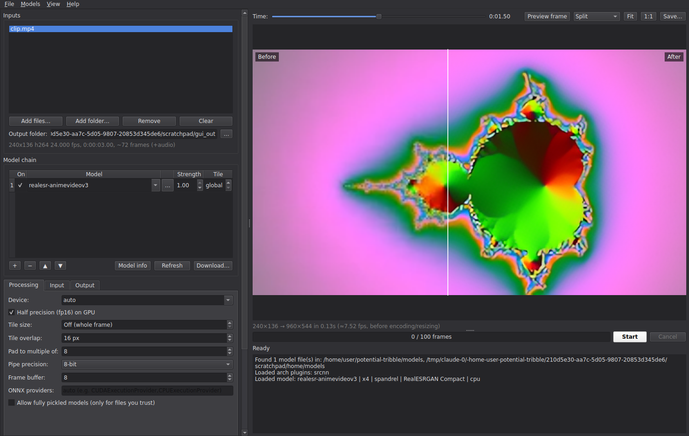
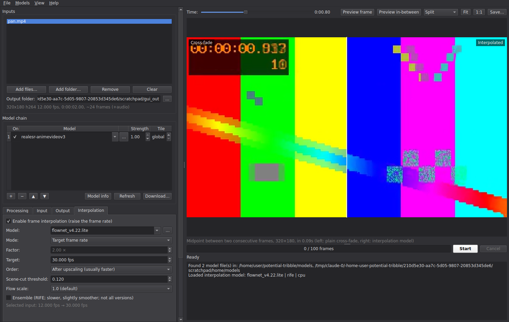

# Tribble Upscaler

Tribble is a local AI video upscaler and frame interpolator with a desktop GUI and a scriptable CLI. It runs any
super-resolution model you give it: community `.pth` and `.safetensors` models, ONNX,
TorchScript, `torch.export` files, or your own architecture through a small Python plugin.
Everything runs on your machine; nothing is uploaded.



## Features

**Models**
- Detects about 40 architectures automatically through
  [spandrel](https://github.com/chaiNNer-org/spandrel). These include ESRGAN, Real-ESRGAN,
  SwinIR, HAT, DAT, OmniSR, SPAN, Compact/SRVGG and RealCUGAN, which covers most of
  [OpenModelDB](https://openmodeldb.info).
- ONNX Runtime with CUDA, TensorRT, DirectML, CoreML or CPU. Models that need a fixed input
  size are tiled automatically.
- TorchScript, `torch.export` (`.pt2`), and fully pickled models (opt-in only).
- [Arch plugins](plugins/README.md): drop in a `.py` file to run any other architecture.
- Per-model [JSON sidecars](models/README.md) override the scale, fp16, channel order,
  padding, tile size and more.
- **Model chaining:** run several models in sequence, such as a denoiser followed by a 4×
  upscaler. Each step has its own **strength** (a blend with bicubic) and tile size.

**Processing**
- CUDA, Apple MPS or CPU, with fp16 where the model supports it.
- Tiled inference with feathered overlap blending, so tile seams don't show. If the GPU runs
  out of memory, the tile size shrinks automatically.
- 8-bit or 16-bit frame pipes, for clean 10-bit output.
- Decoding, inference and encoding run in parallel threads.

**Frame interpolation**
- Uses **RIFE v4.2 to v4.26**, including the lite and heavy variants. One implementation reads
  each checkpoint's layout from its weights, and its output matches the reference ports exactly
  for all 36 variants.
- Raise the frame rate by a factor (2×, 3×, 2.5×, ...) or to an exact target (24 → 60,
  23.976 → 59.94). Output timing is exact, so audio stays in sync.
- Scene-cut detection repeats the last frame at a cut instead of morphing between two shots.
- Choose whether to interpolate before or after upscaling. You can also set RIFE's flow scale
  (0.5 for 4K) and use ensemble mode.
- Other methods: ffmpeg `minterpolate` (motion-compensated, no AI), a plain cross-fade, or your
  own model through an [interpolation plugin](plugins/README.md).
- Can run with no upscaling model, to interpolate only.
- **Preview in-between** (F6) compares a plain cross-fade with the interpolated frame.



**Video**
- ffmpeg pre-filters (deinterlace, denoise, crop and so on) and a pre-downscale, both applied
  before the model.
- Final size: the model's native scale, a scale factor relative to the source, a fixed
  width/height, or an exact size, using any ffmpeg resize filter.
- ffmpeg post-filters (sharpening, grain, color and so on).
- Any ffmpeg encoder: x264, x265, SVT-AV1, VP9, ProRes, FFV1, NVENC, QSV, AMF or VideoToolbox.
  You can set CRF/CQ or a bitrate, the preset, the pixel format, the frame rate, the color
  matrix tags and raw extra arguments.
- Audio and subtitles are passed through (or re-encoded) and trimmed to match the selected
  range.
- A time range or frame limit, a PNG-sequence output, and single images as input or output.

**GUI**
- Drag-and-drop batch queue with per-file status.
- Before/after preview of any frame, with a draggable split, side-by-side view, zoom and pan.
- Model chain editor, model info, a built-in model downloader, and savable presets.
- Progress with fps and ETA, cancel, a log, a dark theme, and settings that persist between
  sessions.

## Install

You need Python 3.9 or newer and **ffmpeg**, either on your PATH or via the `ffmpeg` extra.

```bash
# 1. Install PyTorch for your hardware first: https://pytorch.org/get-started/locally/
#    e.g. NVIDIA:  pip install torch --index-url https://download.pytorch.org/whl/cu124

# 2. Install Tribble with everything (GUI, ONNX, safetensors, bundled ffmpeg)
pip install -e ".[all]"
```

For ONNX models on an NVIDIA GPU, install `onnxruntime-gpu` in place of `onnxruntime`.

## Quick start

```bash
tribble download                          # list the built-in model catalog
tribble download realesr-animevideov3     # tiny and fast: a good first test
tribble download rife-v4.26               # frame interpolation
tribble-gui                               # or: python -m tribble gui
```

In the GUI:

1. Drop videos into **Inputs**.
2. Pick a model in **Model chain**.
3. Press **Preview frame** (F5) to compare the before and after.
4. Optionally, turn on the **Interpolation** tab and check an in-between frame with **Preview
   in-between** (F6).
5. Press **Start**.

### CLI

```bash
# simplest
tribble upscale in.mp4 -m ~/.tribble/models/realesr-animevideov3.pth

# chain two models, blend the second at 60 %, tile for low VRAM, output 4K 10-bit HEVC
tribble upscale in.mkv -m denoise_1x.pth -m 4x_model.safetensors --strength 1 0.6 \
    --tile 512 --height 2160 --codec libx265 --crf 18 --pix-fmt yuv420p10le -o out.mkv

# deinterlace + denoise first, sharpen after, NVENC
tribble upscale old.avi -m model.onnx --pre-filters "bwdif,hqdn3d" \
    --post-filters "cas=0.4" --codec hevc_nvenc --enc-preset p7 --crf 19

# batch a folder with a preset, preview 5 seconds only
tribble upscale clips/*.mp4 --preset presets/anime-fast-hevc.json --start 60 --end 65 --out-dir out/

# upscale 2x and interpolate to 60 fps with RIFE; keep scene cuts sharp
tribble upscale in.mp4 -m 2x_model.pth --interp ~/.tribble/models/flownet_v4.26.pkl --interp-fps 60

# interpolation only: triple the frame rate, flow at half resolution (for 4K sources)
tribble upscale in4k.mkv --interp ~/.tribble/models/flownet_v4.22.lite.pkl --interp-factor 3 --flow-scale 0.5

# no AI: ffmpeg motion interpolation after upscaling
tribble upscale in.mp4 -m model.pth --interp builtin:minterpolate --interp-factor 2

tribble models              # list models, folders and plugins
tribble info model.pth      # what was detected: arch, scale, channels, ...
tribble upscale --help      # every option
```

Every option can be saved to a JSON preset (`--save-preset`, or **Presets → Save** in the GUI)
and reused with `--preset`. Flags given on the command line override the preset.

## Where things live

| What          | Locations                                                                     |
|---------------|-------------------------------------------------------------------------------|
| Models        | `./models`, `~/.tribble/models`, `$TRIBBLE_MODELS`, folders added in the GUI  |
| Arch plugins  | `./plugins`, `~/.tribble/plugins`, `$TRIBBLE_PLUGINS`                         |
| Presets       | `./presets`, `~/.tribble/presets`                                             |
| ffmpeg        | `$TRIBBLE_FFMPEG`, then PATH, then the `imageio-ffmpeg` bundled binary        |

Set `TRIBBLE_HOME` to move `~/.tribble`.

## Tips

- **Out of VRAM?** Set a tile size such as 512 or 256, or leave it off and let Tribble shrink
  it automatically after an out-of-memory error. fp16 roughly halves memory use.
- **Soft or noisy sources:** try a pre-scale of 0.5, or a 1× denoise model chained before the
  upscaler.
- **Too "plastic"?** Lower the model's strength to between 0.6 and 0.8, and/or add grain with
  the post-filter `noise=alls=3:allf=t`.
- **Interpolation order:** interpolating *after* upscaling is usually faster, because the
  upscaler, often the slowest step, then runs only on the original frames. Interpolating
  *before* means the upscaler also cleans up small interpolation artifacts. For 4K frames, set
  the flow scale to 0.5.
- **Scene cuts:** if cuts get morphed, lower the scene-cut threshold (e.g. to 0.08). If fast
  action gets flagged as a cut, raise it.
- **Color:** frames are converted using the source's color matrix, and the output is tagged
  BT.709 for HD and BT.601 for SD, unless you choose a matrix yourself. HDR/PQ tone handling is
  not implemented.

## Development

```bash
pip install -e ".[all,dev]"
pytest
```

The code is organised like this:

- `tribble/models/`: loading, plugins and the registry
- `tribble/inference.py`: tiling and model chains
- `tribble/interp/`: RIFE, frame-rate conversion and scene-cut detection
- `tribble/video.py`: ffmpeg I/O
- `tribble/pipeline.py`: running jobs
- `tribble/cli.py`: the command line interface
- `tribble/gui/`: the PySide6 application
